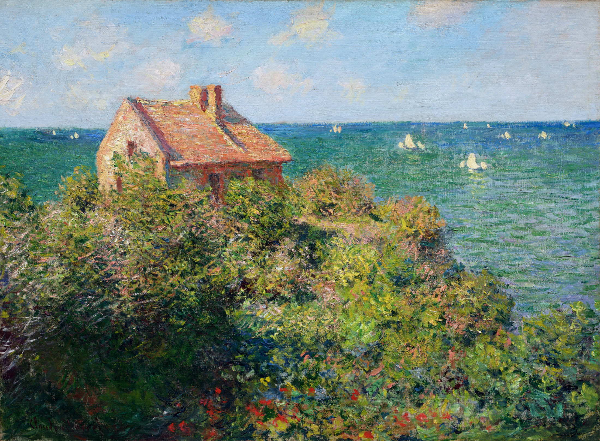
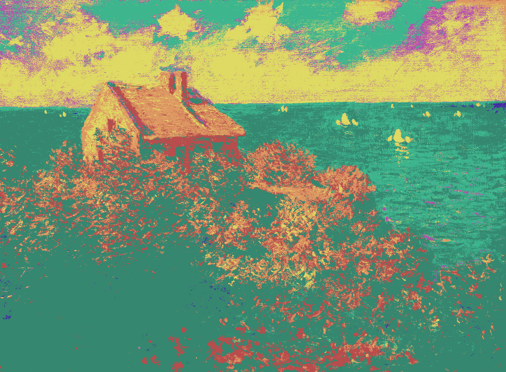
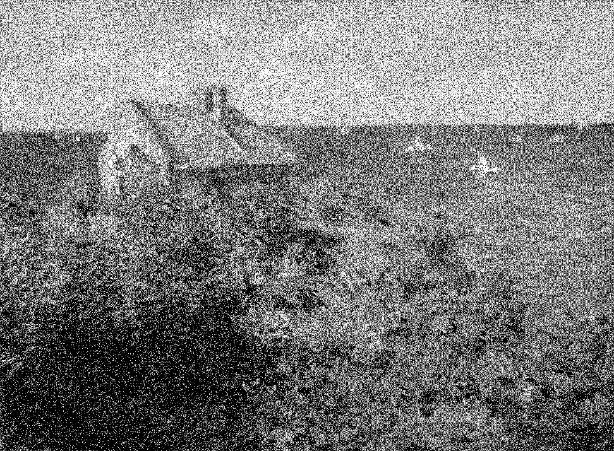
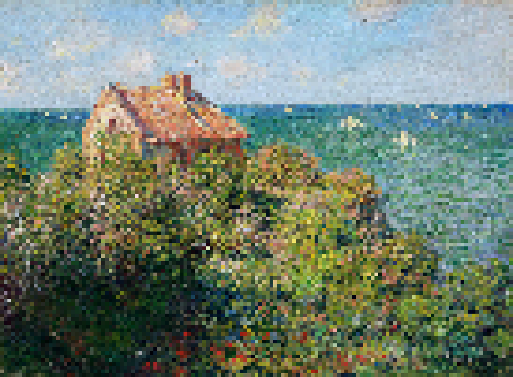
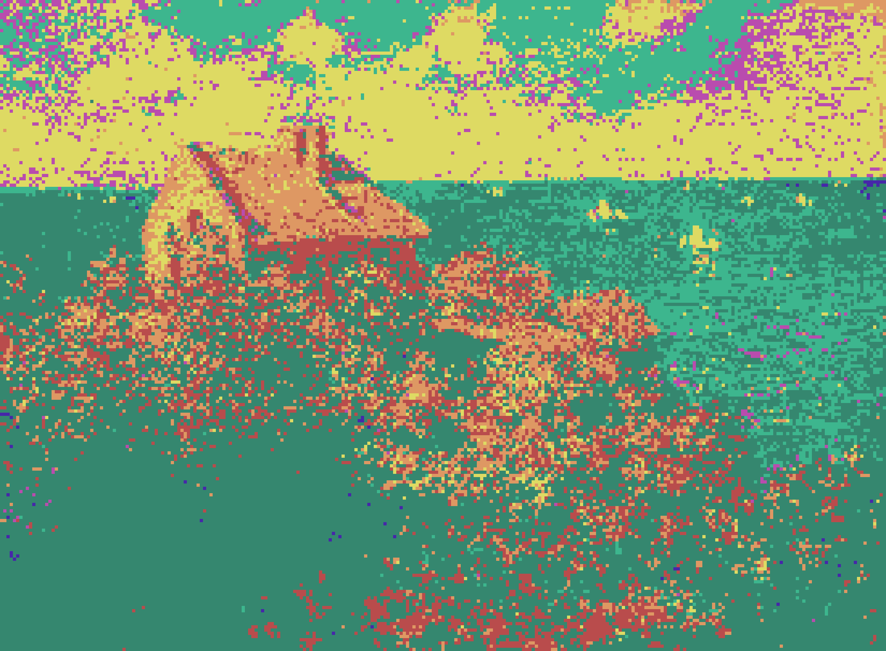
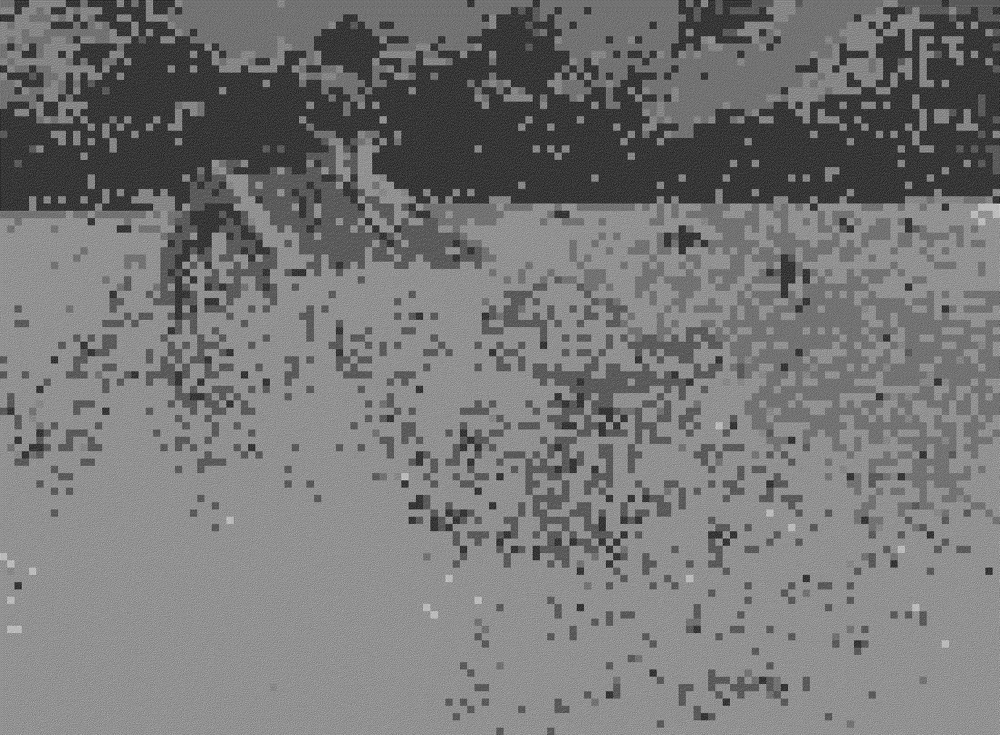

# Image-Rust
A CLI application for applying various image filter algorithms.
## Implemented Filters
- Reverse Colors
- Pixelation
- Floyd-Steinberg Dithering
- Palette Application
## Usage
```
cargo run --release -- <filter_tag_chain> <input_image_path> <output_image_path>
```
## Examples
Original input image:
<p align="center">
  
</p>
Reverse colors:

```
cargo run --release -- -rev input.jpg output.jpg
```

<p align="center">
  
</p>

Apply Palette:
```
cargo run --release -- -pal input.jpg output.jpg
```

<p align="center">
  
</p>

Dithering:
```
cargo run --release -- -floyd input.jpg output.jpg
```

<p align="center">
  
</p>

Pixelate:
```
cargo run --release -- -pix=16 input.jpg output.jpg
```

<p align="center">
  
</p>

Pixelate + Palette (pix=8):
```
cargo run --release -- -pixpal input.jpg output.jpg
```

<p align="center">
  
</p>

Chain Filters:
```
cargo run --release -- -pix=16 -pal -rev -floyd input.jpg output.jpg
```

<p align="center">
  
</p>
